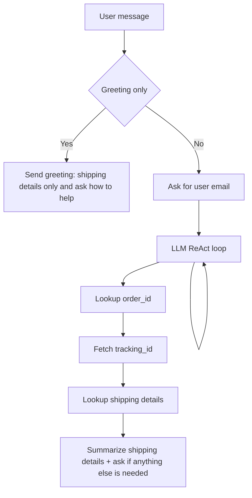

# ReAct Agents
[ReAct: Synergizing Reasoning and Acting in Language Models](https://arxiv.org/abs/2210.03629) agents loop through reasoning and action selection, using tools when needed then synthesizing tools results to either call additional tools, ask user follow-up questions, or return a final answer.

## LangGraph's Customer Support ReAct Agent
This recipe implements an ACME Inc. customer care agent that helps with shipping details. It follows a compound order-inquiry workflow: ask for the user's email, look up the `order_id`, use the `order_id` to fetch the tracking_id, and then use the tracking_id to retrieve shipping details. The agent asks only the minimum follow-up questions needed to complete the workflow and avoids guessing identifiers.


### ReAct Agent Loop
Below is the loop for the ReAct agent. It collects the minimum required identifiers, then uses tools in a fixed sequence to fetch shipping details.


### Implementation
**Prompt**
> You are an ACME Inc. Customer Care ReAct Agent. You must follow the order-inquiry workflow below exactly. Be concise and helpful.
>
> Conversation opening:
> - Begin each new conversation with a short ACME Inc. customer care greeting that states you can only help with shipping details.
>
> Order inquiry workflow (always in this order):
> 1) Ask for the user's email address.
> 2) Use the email address to look up the user's `order_id`.
> 3) Use the `order_id` to fetch the tracking_id.
> 4) Use the tracking_id to look up shipping details.
> 5) Summarize the shipping details for the user and ask if they need anything else.

**Tool routing setup**
```python
TOOLS = [orders, returns, product_inquiry, shipping]
TOOLS_BY_NAME = {tool.name: tool for tool in TOOLS}
MODEL_WITH_TOOLS = model.bind_tools(TOOLS)
```
Defines the supported tools and binds them to the model for single-step tool execution.

**ReAct loop control**
```python
def should_continue(state: MessagesState) -> str:
    last_message = state["messages"][-1]
    if isinstance(last_message, AIMessage) and last_message.tool_calls:
        return "tool_node"
    return END
```
Stops unless the model requested exactly one tool call.

**Model invocation**
```python
def llm_call(state: dict):
    return {
        "messages": [
            MODEL_WITH_TOOLS.invoke(
                [SystemMessage(content=SYSTEM_PROMPT)] + state["messages"]
            )
        ],
        "llm_calls": state.get("llm_calls", 0) + 1,
    }
```
Single call into the model that either returns a response or triggers a tool call.

**Tool execution**
```python
def tool_node(state: dict):
    result = []
    last_message = state["messages"][-1]
    if not isinstance(last_message, AIMessage):
        return {"messages": result}
    for tool_call in last_message.tool_calls:
        tool = TOOLS_BY_NAME[tool_call["name"]]
        observation = tool.invoke(tool_call["args"])
        result.append(ToolMessage(content=str(observation), tool_call_id=tool_call["id"]))
    return {"messages": result}
```
Executes the selected tool and returns its output back to the graph.

**Graph assembly**
```python
def build_agent():
    agent_builder = StateGraph(MessagesState)
    agent_builder.add_node("llm_call", llm_call)
    agent_builder.add_node("tool_node", tool_node)
    agent_builder.add_edge(START, "llm_call")
    agent_builder.add_conditional_edges("llm_call", should_continue, ["tool_node", END])
    agent_builder.add_edge("tool_node", "llm_call")
    return agent_builder.compile()
```
Builds the ReAct loop with a single model node and a tool node.


## Try it yourself!
- Check out the full ReAct Agent recipe here [LangGraph ReAct agent](https://github.com/shahrukhx01/fullstack-agentic-engineering/tree/main/src/agentic-design-patterns/langgraph/react-agents
)
- Create `.env` from `.env.example`.
- Run `make up` and open the UI to test the ReAct agent.
