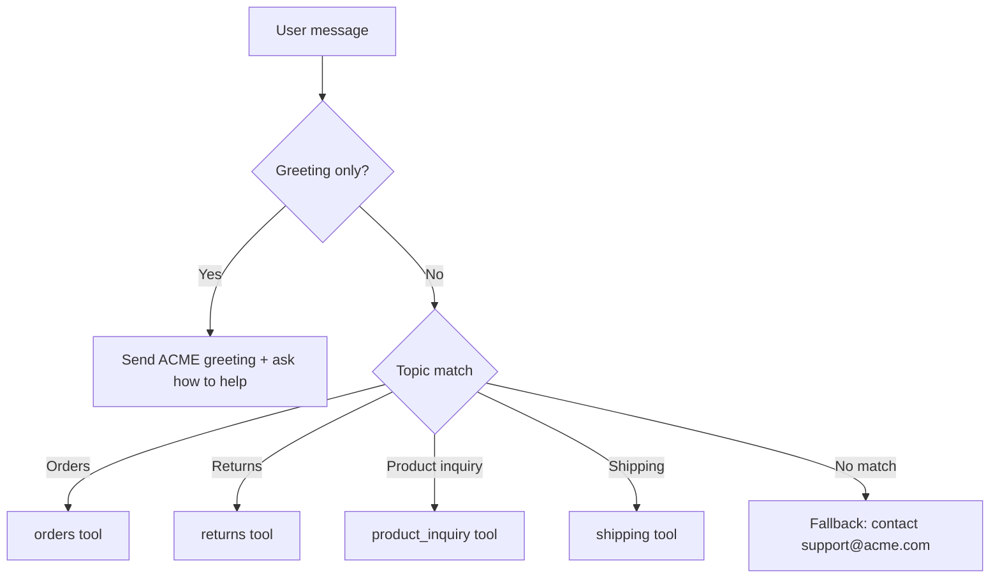

# Reflex Agents
Reflex agents map inputs directly to actions using simple trigger rules. They respond fast and predictably, which makes them ideal for keyword routing, single-step lookups, and basic automations. Their tradeoff is limited expressiveness: they do not handle multistep reasoning or context beyond the immediate input.

## LangGraph's Customer Support Reflex Agent
This recipe implements an ACME Inc. customer care agent that greets users, classifies each message into a single topic, and calls exactly one tool for orders, returns, product inquiries, or shipping. If the message does not match a supported topic, it returns a fixed support escalation response. This keeps the flow fast, predictable, and easy to audit.


### Reflex Agent's Routing Flow
Below is the routing flow of the reflex agent, running in a loop based on the user's intent it triggers one of the underlying tools or responds with the default message that it can't serve user's request. Making sure short, deterministic routing keeps support flows quick and auditable:


### Implementation
**Tool routing setup**
```python
TOOLS = [orders, returns, product_inquiry, shipping]
TOOLS_BY_NAME = {tool.name: tool for tool in TOOLS}
MODEL_WITH_TOOLS = model.bind_tools(TOOLS)
```
Defines the supported tools and binds them to the model for single-step routing.

**Reflex loop control**
```python
def should_continue(state: MessagesState) -> str:
    last_message = state["messages"][-1]
    if isinstance(last_message, AIMessage) and last_message.tool_calls:
        return "tool_node"
    return END
```
Stops unless the model requested exactly one tool call.

**Tool execution**
```python
def tool_node(state: dict):
    result = []
    last_message = state["messages"][-1]
    if not isinstance(last_message, AIMessage):
        return {"messages": result}
    for tool_call in last_message.tool_calls:
        tool = TOOLS_BY_NAME[tool_call["name"]]
        observation = tool.invoke(tool_call["args"])
        result.append(ToolMessage(content=str(observation), tool_call_id=tool_call["id"]))
    return {"messages": result}
```
Executes the selected tool and returns its output back to the graph.


## Try it yourself!
- Check out the full Reflex Agent recipe here [LangGraph reflex agent](https://github.com/shahrukhx01/fullstack-agentic-engineering/tree/main/src/agentic-design-patterns/langgraph/relfex-agents
)
- Create `.env` from `.env.example`.
- Run `make up` and open the UI to test the reflex agent.
